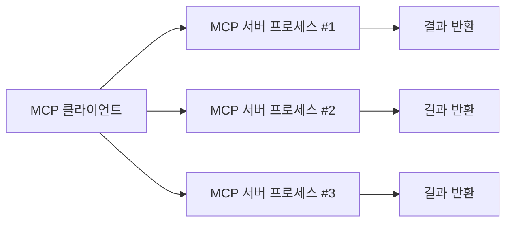

# 모델 컨텍스트 프로토콜 (MCP) 소개

## 개요

모델 컨텍스트 프로토콜(Model Context Protocol, MCP)은 대형 언어 모델(LLM)과 외부 데이터 소스 또는 도구 간의 연결을 표준화하는 개방형 프로토콜입니다. MCP를 사용하면 다양한 데이터 소스나 도구에서 정보를 가져와 모델의 응답에 반영할 수 있어 보다 정확하고 문맥에 맞는 응답을 제공할 수 있습니다.

## MCP가 필요한 이유

기존의 LLM은 학습 데이터에 기반하여 응답을 생성하기 때문에, 실시간 정보나 사용자 맞춤형 데이터를 활용하는 데 한계가 있었습니다. MCP는 이러한 한계를 해결하기 위해 다음과 같은 목적을 가지고 설계되었습니다:

- 다양한 도구 및 데이터 소스 접근 방식의 **표준화**
- 여러 LLM 호스트(예: Claude, ChatGPT 등)와 외부 도구 간의 **통신 구조 단순화**
- **한 번 구현하여 어디서든 사용 가능한 플러그인 시스템** 구축

또한, 다양한 플러그인마다 달랐던 복잡한 개발 과정을 MCP를 통해 일관된 방식으로 단순화할 수 있습니다. 이를 통해 개발자는 복잡한 사전 정의 없이도 LLM에서 외부 도구를 유연하게 호출할 수 있습니다.

## 구성 요소

MCP는 다음 세 가지 주요 요소로 구성됩니다:

### 1. 호스트 (Host)
- LLM이 실행되는 환경 (예: Claude, ChatGPT, IDE 확장 등)
- 사용자의 요청을 분석하여 MCP 클라이언트를 통해 MCP 서버에 요청 전달

### 2. 클라이언트 (Client)
- 호스트에 내장되어 MCP 서버 실행 및 통신을 담당하며, 서버와 1:1 연결을 유지합니다.
- 서버 실행 방식(프로세스 실행 또는 네트워크 연결)에 따라 MCP 서버와 요청/응답을 주고받습니다.

### 3. 서버 (Server)
- 실제 도구 또는 데이터 소스에 접근하는 로직을 보유
- 프롬프트 제공, 리소스 관리 등 복합적인 역할도 수행
- 다양한 언어와 환경에서 구현 가능하며, JSON 기반 프로토콜로 클라이언트와 통신

## 통신 방식과 서버 실행 방식

MCP는 유연한 통신 방식을 지원하여 다양한 시나리오에 대응할 수 있으며, **통신 방식에 따라 서버 실행 방식이 달라집니다.**

- **Stdio (표준 입출력)**: MCP 클라이언트가 MCP 서버를 **요청 시마다 프로세스로 직접 실행**하고, stdin/stdout 으로 요청과 응답을 주고받습니다. 빠르고 가볍습니다. 사용 후 프로세스는 종료됩니다.
- **Server-Sent Events (SSE)**: MCP 서버가 **지속적으로 실행**되며, 클라이언트가 연결을 통해 실시간 스트리밍 응답을 수신합니다.
- **WebSocket (일부 구현체에서 사용됨)**: 서버가 항상 실행되어 있고, 클라이언트와 **지속적인 양방향 연결**을 유지하면서 데이터를 주고받습니다. (*표준은 아님*)
- **HTTP Transport (일부 구현체에서 사용)**: 원격 서버를 호출할 때 사용하며, 서버는 항상 실행되고 REST API 와 유사한 방식으로 요청을 처리합니다.

> 📌 **참고:** 공식 MCP 사양은 Stdio 와 HTTP(S)+SSE 를 표준으로 정의합니다. WebSocket 은 비표준이며, 일부 구현체에서 사용되는 선택적 방식입니다.
> 📌 **보안:** 특히 SSE 사용 시 DNS rebinding 공격 방지를 위해 Origin 헤더 검증 및 localhost 바인딩이 권장됩니다.

### 통신 방식별 사용 시나리오 및 서버 실행 방식

| 통신 방식            | 특징 및 사용 시나리오 | 서버 실행 방식 |
|-------------------|---------------------|--------------------------|
| Stdio             | 로컬 도구 실행, 가볍고 빠름 | 요청 시마다 실행 후 종료 |
| SSE               | 실시간 스트리밍, 대용량 응답 | 서버가 지속적으로 실행 |
| WebSocket         | 양방향 통신 (예: 대화형 응답) | 서버가 지속적으로 실행 (비표준) |
| HTTP Transport    | 원격 서버 호출, REST 유사 | 서버가 지속적으로 실행 (비표준) |

## 작동 방식

1. 사용자가 LLM에 요청 입력
2. 호스트가 요청을 분석하고, 필요한 MCP 서버 호출 판단
3. MCP 클라이언트가 MCP 서버 프로세스를 실행하거나, 네트워크를 통해 서버에 연결하여 요청 전달
4. 서버는 요청을 처리하고 결과를 반환 (선택된 통신 방식으로 전달)
5. 클라이언트가 서버의 출력을 받아 호스트로 전달
6. LLM이 결과를 바탕으로 사용자에게 응답 생성

LLM 자체가 직접 MCP 서버에 접근하는 것이 아니라, **MCP 클라이언트가 중간에서 서버와 연결**하고 요청을 전달합니다. LLM은 클라이언트가 반환하는 응답을 사용하여 마치 외부 도구를 직접 호출하는 것처럼 사용자에게 응답을 생성합니다.

## MCP 전체 구조 흐름도

```mermaid
graph TD
A[사용자 입력] --> B[LLM 호스트]
B --> C[MCP 클라이언트]
C --> D{서버 실행 방식 선택}
D --> E1[MCP 서버 실행 (Stdio)]
D --> E2[연결된 서버에 요청 (SSE/WebSocket/HTTP)]
E1 --> F[도구 또는 데이터 소스 호출]
E2 --> F
F --> G[응답 반환]
G --> C
C --> B
B --> H[LLM 응답 생성]
H --> I[사용자 응답]
```

## MCP 서버 다중 프로세스 및 병렬 처리 구조 (Stdio 기준)

Stdio 방식의 MCP 서버는 요청이 들어올 때마다 별도의 프로세스로 실행되기 때문에, 여러 요청이 동시에 발생하는 경우 각 요청마다 별도의 MCP 서버 프로세스를 실행하여 병렬로 처리할 수 있습니다.



- 각 요청은 독립적인 프로세스에서 처리
- 서버 프로세스 수평 확장 가능
- 서버 프로세스 충돌 시 다른 요청에 영향 없음

## MCP 도구 구성 방식

MCP 서버 내부에는 다양한 도구(툴)가 존재할 수 있으며, 서버는 클라이언트로부터 전달받은 요청에 따라 적절한 도구를 실행합니다.

- 서버는 하나 이상의 도구를 관리하며, 도구마다 고유한 이름과 기능을 가짐
- 요청 시 도구 이름과 파라미터를 기반으로 실행할 도구를 선택

```json
{
  "tool": "DatabaseQuery",
  "parameters": {
    "query": "SELECT * FROM sales WHERE month = 'March'"
  }
}
```

- 도구 실행 결과는 JSON 형식으로 클라이언트에 반환
- 클라이언트는 이를 받아서 LLM 호스트로 전달

> MCP 서버는 단순히 도구만 실행하는 것이 아니라, 프롬프트 제공, 리소스 관리 등 복합적인 역할도 수행할 수 있습니다.

## 예시 시나리오

- **로컬 파일 검색:** "이 문서의 내용 요약해줘" → MCP 서버가 파일을 읽고 내용 전달
- **데이터베이스 쿼리:** "우리 회사 지난달 매출 알려줘" → 내부 DB MCP 서버가 정보 추출
- **HTTP API 통합:** "서울 날씨 어때?" → 외부 날씨 API MCP 서버 호출
- **이미지 처리:** "이 이미지를 흑백으로 변환해줘" → 이미지 처리 MCP 서버 호출
- **코드 실행:** "Python 코드 실행해줘" → 코드 실행 MCP 서버를 통해 결과 반환

## 기존 접근 방식과의 비교

| 항목     | 기존 플러그인 방식                 | MCP 방식                                |
| -------- | ---------------------------------- | --------------------------------------- |
| 통합성   | 도구마다 다름 (비표준)             | 표준 프로토콜 사용, 다양한 도구 통합 가능 |
| 유지보수 | 도구/플러그인별 별도 유지보수 필요 | MCP 서버 하나로 통합, 유지보수 효율적 |
| 확장성   | 호스트별 개별 구현 필요            | 다양한 호스트 지원, 재사용성 우수 |
| 보안     | 방식마다 다름, 관리 어려움          | 명확한 인터페이스, 프로세스 격리, 보안성 향상 |

> 📌 MCP 는 기존 플러그인 방식 대비 하나의 표준 프로토콜로 다양한 도구를 통합할 수 있어, 유지보수 및 확장성이 뛰어납니다.

## MCP 서버 실행 구성 예시

아래는 **Stdio** 통신 방식을 사용하는 경우 MCP 서버를 실행하는 구성 예시입니다.

```json
{
  "inputs": [],
  "servers": {
    "MyFirstMCP": {
      "type": "stdio",
      "command": "dotnet",
      "args": [
        "run",
        "--project",
        "[path].csproj"
      ]
    }
  }
}
```

- `type`: MCP 서버의 실행 방식을 지정 (여기서는 stdio)
- `command`: MCP 서버 실행 시 사용할 명령어
- `args`: MCP 서버 실행 시 전달할 인자들

이 구성은 로컬 환경에서 빠르게 MCP 서버를 실행하고 테스트할 때 유용하며, 개발자가 MCP 도구를 등록하고 바로 사용할 수 있도록 돕습니다.

> 📌 Stdio 방식은 로컬 개발 및 테스트에 적합하며, 서버가 클라이언트 요청마다 실행 후 종료되는 방식입니다.
> 📌 SSE, HTTP Transport 등의 방식은 서버가 별도로 실행되어 있고 클라이언트가 네트워크를 통해 연결합니다. WebSocket 은 일부 구현체에서 사용되지만 MCP 공식 표준은 아닙니다.
> 📌 SSE 사용 시 Origin 헤더 검증과 서버를 localhost 로 바인딩하는 등 보안 설정이 필요합니다. DNS rebinding 공격 등을 방지하기 위한 권장 사항입니다.
